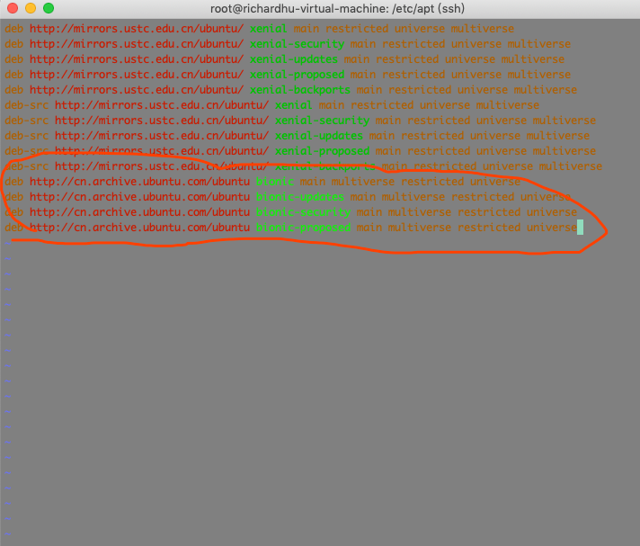
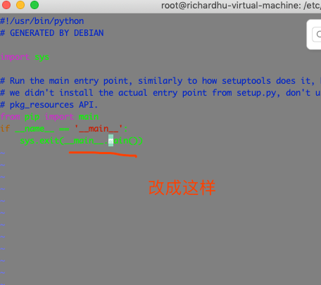
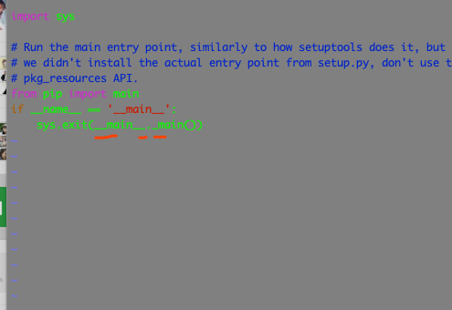
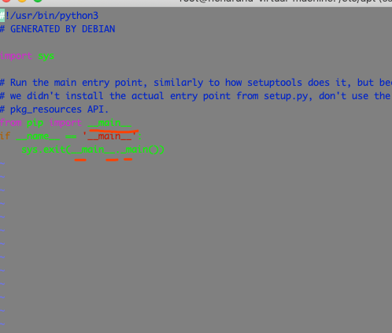
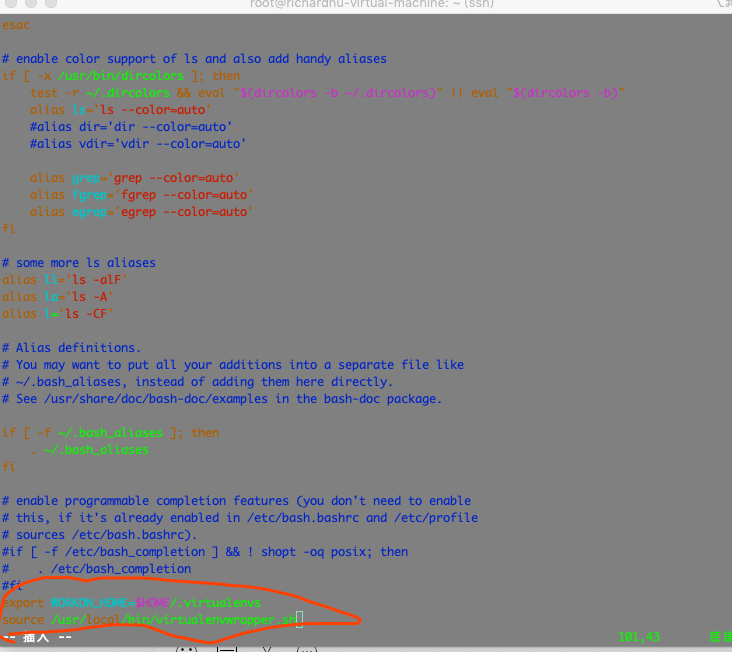

[TOC]
##安装pip3
```
root@richardhu-virtual-machine:/etc/apt# python3
Python 3.6.8 (default, Oct 7 2019, 12:59:55)
[GCC 8.3.0] on linux
Type "help", "copyright", "credits" or "license" for more information.
>>>
[1]+ 已停止 python3
root@richardhu-virtual-machine:/etc/apt# apt install python3-pip
正在读取软件包列表... 完成
正在分析软件包的依赖关系树
正在读取状态信息... 完成
下列软件包是自动安装的并且现在不需要了：
  linux-headers-4.18.0-15 linux-headers-4.18.0-15-generic linux-image-4.18.0-15-generic
  linux-modules-4.18.0-15-generic linux-modules-extra-4.18.0-15-generic
使用'apt autoremove'来卸载它(它们)。
将会同时安装下列软件：
  cpp-5 gcc gcc-5 gcc-5-base libasan2 libatomic1 libcilkrts5 libgcc-5-dev libisl15 libitm1 liblsan0
  libmpfr4 libmpx0 libquadmath0 libtsan0 libubsan0 make python-pip-whl python3-wheel
建议安装：
  gcc-5-locales gcc-multilib manpages-dev autoconf automake libtool flex bison gcc-doc gcc-5-multilib
  gcc-5-doc libgcc1-dbg libgomp1-dbg libitm1-dbg libatomic1-dbg libasan2-dbg liblsan0-dbg libtsan0-dbg
  libubsan0-dbg libcilkrts5-dbg libmpx0-dbg libquadmath0-dbg make-doc python3-setuptools
推荐安装：
  libc6-dev | libc-dev libc6-dev build-essential python3-dev python3-setuptools
下列【新】软件包将被安装：
  cpp-5 gcc gcc-5 gcc-5-base libasan2 libatomic1 libcilkrts5 libgcc-5-dev libisl15 libitm1 liblsan0
  libmpfr4 libmpx0 libquadmath0 libtsan0 libubsan0 make python-pip-whl python3-pip python3-wheel
升级了 0 个软件包，新安装了 20 个软件包，要卸载 0 个软件包，有 0 个软件包未被升级。
需要下载 21.7 MB 的归档。
解压缩后会消耗 66.8 MB 的额外空间。
您希望继续执行吗？ [Y/n] Y
获取:1 http://mirrors.ustc.edu.cn/ubuntu xenial-security/main amd64 gcc-5-base amd64 5.4.0-6ubuntu1~16.04.正准备解包 .../16-make_4.1-6_amd64.deb ...
正在解包 make (4.1-6) ...
正在选中未选择的软件包 python-pip-whl。
正准备解包 .../17-python-pip-whl_8.1.1-2ubuntu0.4_all.deb ...
正在解包 python-pip-whl (8.1.1-2ubuntu0.4) ...
正在选中未选择的软件包 python3-pip。
正准备解包 .../18-python3-pip_8.1.1-2ubuntu0.4_all.deb ...
正在解包 python3-pip (8.1.1-2ubuntu0.4) ...
正在选中未选择的软件包 python3-wheel。
正准备解包 .../19-python3-wheel_0.29.0-1_all.deb ...
正在解包 python3-wheel (0.29.0-1) ...
正在设置 python-pip-whl (8.1.1-2ubuntu0.4) ...
正在设置 make (4.1-6) ...
正在设置 python3-wheel (0.29.0-1) ...
正在设置 libisl15:amd64 (0.16.1-1) ...
正在处理用于 libc-bin (2.27-3ubuntu1) 的触发器 ...
正在设置 python3-pip (8.1.1-2ubuntu0.4) ...
正在设置 libmpfr4:amd64 (3.1.4-1) ...
正在处理用于 man-db (2.8.3-2ubuntu0.1) 的触发器 ...
正在设置 gcc-5-base:amd64 (5.4.0-6ubuntu1~16.04.12) ...
正在设置 libquadmath0:amd64 (5.4.0-6ubuntu1~16.04.12) ...
正在设置 libatomic1:amd64 (5.4.0-6ubuntu1~16.04.12) ...
正在设置 libmpx0:amd64 (5.4.0-6ubuntu1~16.04.12) ...
正在设置 libcilkrts5:amd64 (5.4.0-6ubuntu1~16.04.12) ...
正在设置 libubsan0:amd64 (5.4.0-6ubuntu1~16.04.12) ...
正在设置 libtsan0:amd64 (5.4.0-6ubuntu1~16.04.12) ...
正在设置 libasan2:amd64 (5.4.0-6ubuntu1~16.04.12) ...
正在设置 liblsan0:amd64 (5.4.0-6ubuntu1~16.04.12) ...
正在设置 cpp-5 (5.4.0-6ubuntu1~16.04.12) ...
正在设置 libitm1:amd64 (5.4.0-6ubuntu1~16.04.12) ...
正在设置 libgcc-5-dev:amd64 (5.4.0-6ubuntu1~16.04.12) ...
正在设置 gcc-5 (5.4.0-6ubuntu1~16.04.12) ...
正在设置 gcc (4:5.3.1-1ubuntu1) ...
正在处理用于 libc-bin (2.27-3ubuntu1) 的触发器 .
====================================================================================================================

```

## 安装pip3遇到的问题
```
root@richardhu-virtual-machine:/etc/apt# pip3
Traceback (most recent call last):
  File "/usr/bin/pip3", line 9, in <module>
    from pip import main
  File "/usr/lib/python3/dist-packages/pip/__init__.py", line 14, in <module>
    from pip.utils import get_installed_distributions, get_prog
  File "/usr/lib/python3/dist-packages/pip/utils/__init__.py", line 23, in <module>
    from pip.locations import (
  File "/usr/lib/python3/dist-packages/pip/locations.py", line 9, in <module>
    from distutils import sysconfig
ImportError: cannot import name 'sysconfig'
root@richardhu-virtual-machine:/etc/apt# which pip3
/usr/bin/pip3
root@richardhu-virtual-machine:/etc/apt# pip3 -v
Traceback (most recent call last):
  File "/usr/bin/pip3", line 9, in <module>
    from pip import main
  File "/usr/lib/python3/dist-packages/pip/__init__.py", line 14, in <module>
    from pip.utils import get_installed_distributions, get_prog
  File "/usr/lib/python3/dist-packages/pip/utils/__init__.py", line 23, in <module>
    from pip.locations import (
  File "/usr/lib/python3/dist-packages/pip/locations.py", line 9, in <module>
    from distutils import sysconfig
ImportError: cannot import name 'sysconfig'
```

### 解决:
https://blog.csdn.net/qq_27366789/article/details/80559074
https://blog.csdn.net/weixin_39394526/article/details/87937645
追加几个源:

```
root@richardhu-virtual-machine:/etc/apt# vi sources.list
root@richardhu-virtual-machine:/etc/apt# apt-get update
获取:1 http://cn.archive.ubuntu.com/ubuntu bionic InRelease [242 kB]
获取:2 http://cn.archive.ubuntu.com/ubuntu bionic-updates InRelease [88.7 kB]
获取:3 http://cn.archive.ubuntu.com/ubuntu bionic-security InRelease [88.7 kB]
获取:4 http://cn.archive.ubuntu.com/ubuntu bionic-proposed InRelease [242 kB]
获取:5 http://cn.archive.ubuntu.com/ubuntu bionic/main amd64 Packages [1,019 kB]
获取:6 http://cn.archive.ubuntu.com/ubuntu bionic/main i386 Packages [1,007 kB]
获取:7 http://cn.archive.ubuntu.com/ubuntu bionic/main Translation-en [516 kB]
获取:8 http://cn.archive.ubuntu.com/ubuntu bionic/main Translation-zh_CN [67.7 kB]
获取:9 http://cn.archive.ubuntu.com/ubuntu bionic/main amd64 DEP-11 Metadata [477 kB]
获取:10 http://cn.archive.ubuntu.com/ubuntu bionic/main DEP-11 48x48 Icons [118 kB]
获取:11 http://cn.archive.ubuntu.com/ubuntu bionic/main DEP-11 64x64 Icons [245 kB]
获取:12 http://cn.archive.ubuntu.com/ubuntu bionic/multiverse i386 Packages [144 kB]
获取:13 http://cn.archive.ubuntu.com/ubuntu bionic/multiverse amd64 Packages [151 kB]
获取:14 http://cn.archive.ubuntu.com/ubuntu bionic/multiverse Translation-zh_CN [4,768 B]
获取:15 http://cn.archive.ubuntu.com/ubuntu bionic/multiverse Translation-en [108 kB]
获取:16 http://cn.archive.ubuntu.com/ubuntu bionic/multiverse amd64 DEP-11 Metadata [49.7 kB]
获取:17 http://cn.archive.ubuntu.com/ubuntu bionic/multiverse DEP-11 48x48 Icons [8,931 B]
获取:18 http://cn.archive.ubuntu.com/ubuntu bionic/multiverse DEP-11 64x64 Icons [225 kB]
获取:19 http://cn.archive.ubuntu.com/ubuntu bionic/restricted i386 Packages [9,156 B]
获取:20 http://cn.archive.ubuntu.com/ubuntu bionic/restricted amd64 Packages [9,184 B]
获取:21 http://cn.archive.ubuntu.com/ubuntu bionic/restricted Translation-zh_CN [1,188 B]
获取:22 http://cn.archive.ubuntu.com/ubuntu bionic/restricted Translation-en [3,584 B]
获取:23 http://cn.archive.ubuntu.com/ubuntu bionic/universe amd64 Packages [8,570 kB]
命中:24 http://mirrors.ustc.edu.cn/ubuntu xenial InRelease
命中:25 http://mirrors.ustc.edu.cn/ubuntu xenial-security InRelease
命中:26 http://mirrors.ustc.edu.cn/ubuntu xenial-updates InRelease
命中:27 http://mirrors.ustc.edu.cn/ubuntu xenial-proposed InRelease
命中:28 http://mirrors.ustc.edu.cn/ubuntu xenial-backports InRelease
获取:29 http://cn.archive.ubuntu.com/ubuntu bionic/universe i386 Packages [8,531 kB]
获取:30 http://cn.archive.ubuntu.com/ubuntu bionic/universe Translation-zh_CN [174 kB]
获取:31 http://cn.archive.ubuntu.com/ubuntu bionic/universe Translation-en [4,941 kB]
获取:32 http://cn.archive.ubuntu.com/ubuntu bionic/universe amd64 DEP-11 Metadata [3,287 kB]
获取:33 http://cn.archive.ubuntu.com/ubuntu bionic/universe DEP-11 48x48 Icons [2,151 kB]
获取:34 http://cn.archive.ubuntu.com/ubuntu bionic/universe DEP-11 64x64 Icons [8,420 kB]
获取:35 http://cn.archive.ubuntu.com/ubuntu bionic-updates/main amd64 Packages [817 kB]
获取:36 http://cn.archive.ubuntu.com/ubuntu bionic-updates/main i386 Packages [625 kB]
获取:37 http://cn.archive.ubuntu.com/ubuntu bionic-updates/main Translation-en [288 kB]
获取:37 http://cn.archive.ubuntu.com/ubuntu bionic-updates/main Translation-en [288 kB]
获取:38 http://cn.archive.ubuntu.com/ubuntu bionic-updates/main amd64 DEP-11 Metadata [295 kB]
获取:39 http://cn.archive.ubuntu.com/ubuntu bionic-updates/main DEP-11 48x48 Icons [73.8 kB]
获取:40 http://cn.archive.ubuntu.com/ubuntu bionic-updates/main DEP-11 64x64 Icons [147 kB]
获取:41 http://cn.archive.ubuntu.com/ubuntu bionic-updates/multiverse i386 Packages [7,484 B]
获取:42 http://cn.archive.ubuntu.com/ubuntu bionic-updates/multiverse amd64 Packages [9,284 B]
获取:43 http://cn.archive.ubuntu.com/ubuntu bionic-updates/multiverse Translation-en [4,508 B]
获取:44 http://cn.archive.ubuntu.com/ubuntu bionic-updates/multiverse amd64 DEP-11 Metadata [2,468 B]
获取:45 http://cn.archive.ubuntu.com/ubuntu bionic-updates/multiverse DEP-11 48x48 Icons [29 B]
获取:46 http://cn.archive.ubuntu.com/ubuntu bionic-updates/multiverse DEP-11 64x64 Icons [2,638 B]
获取:47 http://cn.archive.ubuntu.com/ubuntu bionic-updates/restricted amd64 Packages [24.1 kB]
获取:48 http://cn.archive.ubuntu.com/ubuntu bionic-updates/restricted i386 Packages [9,584 B]
获取:49 http://cn.archive.ubuntu.com/ubuntu bionic-updates/restricted Translation-en [6,620 B]
获取:50 http://cn.archive.ubuntu.com/ubuntu bionic-updates/universe amd64 Packages [1,033 kB]
获取:51 http://cn.archive.ubuntu.com/ubuntu bionic-updates/universe i386 Packages [997 kB]
获取:52 http://cn.archive.ubuntu.com/ubuntu bionic-updates/universe Translation-en [319 kB]
获取:53 http://cn.archive.ubuntu.com/ubuntu bionic-updates/universe amd64 DEP-11 Metadata [264 kB]
获取:54 http://cn.archive.ubuntu.com/ubuntu bionic-updates/universe DEP-11 48x48 Icons [208 kB]
获取:55 http://cn.archive.ubuntu.com/ubuntu bionic-updates/universe DEP-11 64x64 Icons [464 kB]
获取:56 http://cn.archive.ubuntu.com/ubuntu bionic-security/main amd64 Packages [593 kB]
获取:56 http://cn.archive.ubuntu.com/ubuntu bionic-security/main amd64 Packages [593 kB]
获取:57 http://cn.archive.ubuntu.com/ubuntu bionic-security/main i386 Packages [414 kB]
获取:58 http://cn.archive.ubuntu.com/ubuntu bionic-security/main Translation-en [194 kB]
获取:59 http://cn.archive.ubuntu.com/ubuntu bionic-security/main amd64 DEP-11 Metadata [38.5 kB]
获取:60 http://cn.archive.ubuntu.com/ubuntu bionic-security/main DEP-11 48x48 Icons [17.6 kB]
获取:61 http://cn.archive.ubuntu.com/ubuntu bionic-security/main DEP-11 64x64 Icons [41.5 kB]
获取:62 http://cn.archive.ubuntu.com/ubuntu bionic-security/multiverse i386 Packages [4,288 B]
获取:63 http://cn.archive.ubuntu.com/ubuntu bionic-security/multiverse amd64 Packages [6,120 B]
获取:64 http://cn.archive.ubuntu.com/ubuntu bionic-security/multiverse Translation-en [2,600 B]
获取:65 http://cn.archive.ubuntu.com/ubuntu bionic-security/multiverse amd64 DEP-11 Metadata [2,464 B]
获取:66 http://cn.archive.ubuntu.com/ubuntu bionic-security/multiverse DEP-11 48x48 Icons [29 B]
获取:67 http://cn.archive.ubuntu.com/ubuntu bionic-security/multiverse DEP-11 64x64 Icons [2,638 B]
获取:68 http://cn.archive.ubuntu.com/ubuntu bionic-security/restricted i386 Packages [4,280 B]
获取:69 http://cn.archive.ubuntu.com/ubuntu bionic-security/restricted amd64 Packages [15.1 kB]
获取:70 http://cn.archive.ubuntu.com/ubuntu bionic-security/restricted Translation-en [4,684 B]
获取:71 http://cn.archive.ubuntu.com/ubuntu bionic-security/universe i386 Packages [602 kB]
获取:72 http://cn.archive.ubuntu.com/ubuntu bionic-security/universe amd64 Packages [627 kB]
获取:72 http://cn.archive.ubuntu.com/ubuntu bionic-security/universe amd64 Packages [627 kB]
获取:73 http://cn.archive.ubuntu.com/ubuntu bionic-security/universe Translation-en [210 kB]
获取:74 http://cn.archive.ubuntu.com/ubuntu bionic-security/universe amd64 DEP-11 Metadata [42.1 kB]
获取:74 http://cn.archive.ubuntu.com/ubuntu bionic-security/universe amd64 DEP-11 Metadata [42.1 kB]
获取:75 http://cn.archive.ubuntu.com/ubuntu bionic-security/universe DEP-11 48x48 Icons [16.4 kB]
获取:76 http://cn.archive.ubuntu.com/ubuntu bionic-security/universe DEP-11 64x64 Icons [116 kB]
获取:77 http://cn.archive.ubuntu.com/ubuntu bionic-proposed/main amd64 Packages [101 kB]
获取:78 http://cn.archive.ubuntu.com/ubuntu bionic-proposed/main i386 Packages [73.2 kB]
获取:79 http://cn.archive.ubuntu.com/ubuntu bionic-proposed/main Translation-zh_CN [67.7 kB]
获取:80 http://cn.archive.ubuntu.com/ubuntu bionic-proposed/main Translation-en [40.4 kB]
获取:81 http://cn.archive.ubuntu.com/ubuntu bionic-proposed/main amd64 DEP-11 Metadata [102 kB]
获取:82 http://cn.archive.ubuntu.com/ubuntu bionic-proposed/main DEP-11 48x48 Icons [9,364 B]
获取:83 http://cn.archive.ubuntu.com/ubuntu bionic-proposed/main DEP-11 64x64 Icons [17.0 kB]
获取:84 http://cn.archive.ubuntu.com/ubuntu bionic-proposed/multiverse amd64 Packages [1,088 B]
获取:85 http://cn.archive.ubuntu.com/ubuntu bionic-proposed/multiverse Translation-en [532 B]
获取:86 http://cn.archive.ubuntu.com/ubuntu bionic-proposed/multiverse Translation-zh_CN [4,768 B]
获取:87 http://cn.archive.ubuntu.com/ubuntu bionic-proposed/multiverse amd64 DEP-11 Metadata [2,468 B]
获取:88 http://cn.archive.ubuntu.com/ubuntu bionic-proposed/multiverse DEP-11 48x48 Icons [29 B]
获取:89 http://cn.archive.ubuntu.com/ubuntu bionic-proposed/multiverse DEP-11 64x64 Icons [2,638 B]
获取:90 http://cn.archive.ubuntu.com/ubuntu bionic-proposed/restricted amd64 Packages [7,636 B]
获取:91 http://cn.archive.ubuntu.com/ubuntu bionic-proposed/restricted Translation-en [2,208 B]
获取:92 http://cn.archive.ubuntu.com/ubuntu bionic-proposed/restricted Translation-zh_CN [1,188 B]
获取:93 http://cn.archive.ubuntu.com/ubuntu bionic-proposed/universe i386 Packages [43.3 kB]
获取:94 http://cn.archive.ubuntu.com/ubuntu bionic-proposed/universe amd64 Packages [47.4 kB]
获取:95 http://cn.archive.ubuntu.com/ubuntu bionic-proposed/universe Translation-en [25.8 kB]
获取:96 http://cn.archive.ubuntu.com/ubuntu bionic-proposed/universe Translation-zh_CN [174 kB]
获取:97 http://cn.archive.ubuntu.com/ubuntu bionic-proposed/universe amd64 DEP-11 Metadata [23.9 kB]
获取:98 http://cn.archive.ubuntu.com/ubuntu bionic-proposed/universe DEP-11 48x48 Icons [10.1 kB]
获取:99 http://cn.archive.ubuntu.com/ubuntu bionic-proposed/universe DEP-11 64x64 Icons [16.8 kB]
已下载 50.1 MB，耗时 6分 0秒 (139 kB/s)
正在读取软件包列表... 完成

====================================================================================================================
root@richardhu-virtual-machine:/etc/apt# apt-get remove python3-pip
正在读取软件包列表... 完成
正在分析软件包的依赖关系树
正在读取状态信息... 完成
下列软件包是自动安装的并且现在不需要了：
  linux-headers-4.18.0-15 linux-headers-4.18.0-15-generic linux-image-4.18.0-15-generic
  linux-modules-4.18.0-15-generic linux-modules-extra-4.18.0-15-generic python-pip-whl python3-wheel
使用'apt autoremove'来卸载它(它们)。
下列软件包将被【卸载】：
  python3-pip
升级了 0 个软件包，新安装了 0 个软件包，要卸载 1 个软件包，有 339 个软件包未被升级。
解压缩后将会空出 569 kB 的空间。
您希望继续执行吗？ [Y/n] Y
(正在读取数据库 ... 系统当前共安装有 204106 个文件和目录。)
正在卸载 python3-pip (8.1.1-2ubuntu0.4) ...
正在处理用于 man-db (2.8.3-2ubuntu0.1) 的触发器 ...

====================================================================================================================
root@richardhu-virtual-machine:/etc/apt# apt-get install python3-pip
正在读取软件包列表... 完成
正在分析软件包的依赖关系树
正在读取状态信息... 完成
下列软件包是自动安装的并且现在不需要了：
  linux-headers-4.18.0-15 linux-headers-4.18.0-15-generic linux-image-4.18.0-15-generic
  linux-modules-4.18.0-15-generic linux-modules-extra-4.18.0-15-generic
使用'apt autoremove'来卸载它(它们)。
将会同时安装下列软件：
  build-essential cpp-7 dh-python dpkg-dev fakeroot g++ g++-7 gcc gcc-7 gcc-7-base gcc-8-base
  libalgorithm-diff-perl libalgorithm-diff-xs-perl libalgorithm-merge-perl libasan4 libatomic1
  libc-dev-bin libc6-dev libcc1-0 libcilkrts5 libdpkg-perl libexpat1-dev libfakeroot libgcc-7-dev
  libgcc1 libgomp1 libitm1 liblsan0 libmpx2 libpython3-dev libpython3.6 libpython3.6-dev
  libpython3.6-minimal libpython3.6-stdlib libquadmath0 libstdc++-7-dev libstdc++6 libtsan0 libubsan0
  linux-libc-dev manpages-dev python-pip-whl python3-dev python3-distutils python3-lib2to3
  python3-setuptools python3.6 python3.6-dev python3.6-minimal
建议安装：
  gcc-7-locales debian-keyring g++-multilib g++-7-multilib gcc-7-doc libstdc++6-7-dbg gcc-multilib
  autoconf automake libtool flex bison gcc-doc gcc-7-multilib libgcc1-dbg libgomp1-dbg libitm1-dbg
  libatomic1-dbg libasan4-dbg liblsan0-dbg libtsan0-dbg libubsan0-dbg libcilkrts5-dbg libmpx2-dbg
  libquadmath0-dbg glibc-doc git bzr libstdc++-7-doc python-setuptools-doc python3.6-venv python3.6-doc
  binfmt-support
下列【新】软件包将被安装：
  build-essential dh-python dpkg-dev fakeroot g++ g++-7 gcc-7 libalgorithm-diff-perl
  libalgorithm-diff-xs-perl libalgorithm-merge-perl libasan4 libc-dev-bin libc6-dev libexpat1-dev
  libfakeroot libgcc-7-dev libmpx2 libpython3-dev libpython3.6-dev libstdc++-7-dev linux-libc-dev
  manpages-dev python3-dev python3-distutils python3-lib2to3 python3-pip python3-setuptools
  python3.6-dev
下列软件包将被升级：
  cpp-7 gcc gcc-7-base gcc-8-base libatomic1 libcc1-0 libcilkrts5 libdpkg-perl libgcc1 libgomp1 libitm1
  liblsan0 libpython3.6 libpython3.6-minimal libpython3.6-stdlib libquadmath0 libstdc++6 libtsan0
  libubsan0 python-pip-whl python3.6 python3.6-minimal
升级了 22 个软件包，新安装了 28 个软件包，要卸载 0 个软件包，有 317 个软件包未被升级。
需要下载 93.4 MB 的归档。
解压缩后会消耗 203 MB 的额外空间。
您希望继续执行吗？ [Y/n] Y
获取:1 http://cn.archive.ubuntu.com/ubuntu bionic-updates/main amd64 libpython3.6 amd64 3.6.9-1~18.04 [1,414 kB]
获取:2 http://cn.archive.ubuntu.com/ubuntu bionic-updates/main amd64 python3.6 amd64 3.6.9-1~18.04 [203 kB]
获取:3 http://cn.archive.ubuntu.com/ubuntu bionic-updates/main amd64 libpython3.6-stdlib amd64 3.6.9-1~18.04 [1,709 kB]
获取:4 http://cn.archive.ubuntu.com/ubuntu bionic-updates/main amd64 python3.6-minimal amd64 3.6.9-1~18.04 [1,610 kB]
获取:5 http://cn.archive.ubuntu.com/ubuntu bionic-updates/main amd64 libpython3.6-minimal amd64 3.6.9-1~18.04 [533 kB]
获取:6 http://cn.archive.ubuntu.com/ubuntu bionic-proposed/main amd64 gcc-8-base amd64 8.3.0-26ubuntu1~18.04 [18.3 kB]
获取:7 http://cn.archive.ubuntu.com/ubuntu bionic-proposed/main amd64 libstdc++6 amd64 8.3.0-26ubuntu1~18.04 [400 kB]
获取:8 http://cn.archive.ubuntu.com/ubuntu bionic-proposed/main amd64 libgomp1 amd64 8.3.0-26ubuntu1~18.04 [76.5 kB]
获取:9 http://cn.archive.ubuntu.com/ubuntu bionic-proposed/main amd64 libcc1-0 amd64 8.3.0-26ubuntu1~18.04 [39.4 kB]
获取:10 http://cn.archive.ubuntu.com/ubuntu bionic-proposed/main amd64 libgcc1 amd64 1:8.3.0-26ubuntu1~18.04 [40.7 kB]
获取:11 http://cn.archive.ubuntu.com/ubuntu bionic/main amd64 libc-dev-bin amd64 2.27-3ubuntu1 [71.8 kB]
获取:12 http://cn.archive.ubuntu.com/ubuntu bionic-proposed/main amd64 linux-libc-dev amd64 4.15.0-74.84 [1,015 kB]
获取:13 http://cn.archive.ubuntu.com/ubuntu bionic/main amd64 libc6-dev amd64 2.27-3ubuntu1 [2,587 kB]
获取:14 http://mirrors.ustc.edu.cn/ubuntu xenial/main amd64 libalgorithm-diff-perl all 1.19.03-1 [47.6 kB]
获取:15 http://mirrors.ustc.edu.cn/ubuntu xenial/main amd64 libalgorithm-merge-perl all 0.08-3 [12.0 kB]
获取:16 http://cn.archive.ubuntu.com/ubuntu bionic-proposed/main amd64 cpp-7 amd64 7.5.0-3ubuntu1~18.04 [8,591 kB]
获取:17 http://cn.archive.ubuntu.com/ubuntu bionic-proposed/main amd64 gcc-7-base amd64 7.5.0-3ubuntu1~18.04 [18.3 kB]
获取:18 http://cn.archive.ubuntu.com/ubuntu bionic-proposed/main amd64 libitm1 amd64 8.3.0-26ubuntu1~18.04 [27.9 kB]
获取:19 http://cn.archive.ubuntu.com/ubuntu bionic-proposed/main amd64 libatomic1 amd64 8.3.0-26ubuntu1~18.04 [9,192 B]
获取:20 http://cn.archive.ubuntu.com/ubuntu bionic-proposed/main amd64 libasan4 amd64 7.5.0-3ubuntu1~18.04 [358 kB]
获取:20 http://cn.archive.ubuntu.com/ubuntu bionic-proposed/main amd64 libasan4 amd64 7.5.0-3ubuntu1~18.04 [358 kB]
获取:21 http://cn.archive.ubuntu.com/ubuntu bionic-proposed/main amd64 liblsan0 amd64 8.3.0-26ubuntu1~18.04 [133 kB]
获取:22 http://cn.archive.ubuntu.com/ubuntu bionic-proposed/main amd64 libtsan0 amd64 8.3.0-26ubuntu1~18.04 [288 kB]
获取:23 http://cn.archive.ubuntu.com/ubuntu bionic-proposed/main amd64 libubsan0 amd64 7.5.0-3ubuntu1~18.04 [126 kB]
获取:24 http://cn.archive.ubuntu.com/ubuntu bionic-proposed/main amd64 libcilkrts5 amd64 7.5.0-3ubuntu1~18.04 [42.5 kB]
获取:25 http://cn.archive.ubuntu.com/ubuntu bionic-proposed/main amd64 libmpx2 amd64 8.3.0-26ubuntu1~18.04 [11.6 kB]
获取:26 http://cn.archive.ubuntu.com/ubuntu bionic-proposed/main amd64 libquadmath0 amd64 8.3.0-26ubuntu1~18.04 [134 kB]
获取:27 http://cn.archive.ubuntu.com/ubuntu bionic-proposed/main amd64 libgcc-7-dev amd64 7.5.0-3ubuntu1~18.04 [2,378 kB]
获取:28 http://cn.archive.ubuntu.com/ubuntu bionic-proposed/main amd64 gcc-7 amd64 7.5.0-3ubuntu1~18.04 [9,381 kB]
获取:29 http://cn.archive.ubuntu.com/ubuntu bionic-updates/main amd64 gcc amd64 4:7.4.0-1ubuntu2.3 [5,184 B]
获取:30 http://cn.archive.ubuntu.com/ubuntu bionic-proposed/main amd64 libstdc++-7-dev amd64 7.5.0-3ubuntu1~18.04 [1,471 kB]
获取:31 http://cn.archive.ubuntu.com/ubuntu bionic-proposed/main amd64 g++-7 amd64 7.5.0-3ubuntu1~18.04 [9,697 kB]
获取:32 http://cn.archive.ubuntu.com/ubuntu bionic-updates/main amd64 g++ amd64 4:7.4.0-1ubuntu2.3 [1,568 B]
获取:33 http://cn.archive.ubuntu.com/ubuntu bionic-updates/main amd64 libdpkg-perl all 1.19.0.5ubuntu2.3 [211 kB]
获取:33 http://cn.archive.ubuntu.com/ubuntu bionic-updates/main amd64 libdpkg-perl all 1.19.0.5ubuntu2.3 [211 kB]
获取:34 http://cn.archive.ubuntu.com/ubuntu bionic-updates/main amd64 dpkg-dev all 1.19.0.5ubuntu2.3 [607 kB]
获取:35 http://cn.archive.ubuntu.com/ubuntu bionic/main amd64 build-essential amd64 12.4ubuntu1 [4,758 B]
获取:36 http://cn.archive.ubuntu.com/ubuntu bionic-updates/main amd64 python3-lib2to3 all 3.6.9-1~18.04 [77.4 kB]
获取:37 http://cn.archive.ubuntu.com/ubuntu bionic-updates/main amd64 python3-distutils all 3.6.9-1~18.04 [144 kB]
获取:38 http://cn.archive.ubuntu.com/ubuntu bionic/main amd64 dh-python all 3.20180325ubuntu2 [89.2 kB]
获取:39 http://cn.archive.ubuntu.com/ubuntu bionic/main amd64 libfakeroot amd64 1.22-2ubuntu1 [25.9 kB]
获取:40 http://cn.archive.ubuntu.com/ubuntu bionic/main amd64 fakeroot amd64 1.22-2ubuntu1 [62.3 kB]
获取:41 http://cn.archive.ubuntu.com/ubuntu bionic/main amd64 libalgorithm-diff-xs-perl amd64 0.04-5 [11.1 kB]
获取:42 http://cn.archive.ubuntu.com/ubuntu bionic-updates/main amd64 libexpat1-dev amd64 2.2.5-3ubuntu0.2 [122 kB]
获取:43 http://cn.archive.ubuntu.com/ubuntu bionic-updates/main amd64 libpython3.6-dev amd64 3.6.9-1~18.04 [44.8 MB]
获取:44 http://cn.archive.ubuntu.com/ubuntu bionic-updates/main amd64 libpython3-dev amd64 3.6.7-1~18.04 [7,328 B]
获取:45 http://cn.archive.ubuntu.com/ubuntu bionic/main amd64 manpages-dev all 4.15-1 [2,217 kB]
获取:46 http://cn.archive.ubuntu.com/ubuntu bionic-updates/universe amd64 python-pip-whl all 9.0.1-2.3~ubuntu1.18.04.1 [1,653 kB]
获取:47 http://cn.archive.ubuntu.com/ubuntu bionic-updates/main amd64 python3.6-dev amd64 3.6.9-1~18.04 [508 kB]
获取:48 http://cn.archive.ubuntu.com/ubuntu bionic-updates/main amd64 python3-dev amd64 3.6.7-1~18.04 [1,288 B]
获取:49 http://cn.archive.ubuntu.com/ubuntu bionic-updates/universe amd64 python3-pip all 9.0.1-2.3~ubuntu1.18.04.1 [114 kB]
获取:50 http://cn.archive.ubuntu.com/ubuntu bionic/main amd64 python3-setuptools all 39.0.1-2 [248 kB]
已下载 93.2 MB，耗时 19分 0秒 (81.7 kB/s)
正在从软件包中解出模板：100%
(正在读取数据库 ... 系统当前共安装有 204033 个文件和目录。)
正准备解包 .../0-libpython3.6_3.6.9-1~18.04_amd64.deb ...
正在将 libpython3.6:amd64 (3.6.9-1~18.04) 解包到 (3.6.8-1~18.04.3) 上 ...
正准备解包 .../1-python3.6_3.6.9-1~18.04_amd64.deb ...
正在将 python3.6 (3.6.9-1~18.04) 解包到 (3.6.8-1~18.04.3) 上 ...
正准备解包 .../2-libpython3.6-stdlib_3.6.9-1~18.04_amd64.deb ...
正在将 libpython3.6-stdlib:amd64 (3.6.9-1~18.04) 解包到 (3.6.8-1~18.04.3) 上 ...
正准备解包 .../3-python3.6-minimal_3.6.9-1~18.04_amd64.deb ...
正在将 python3.6-minimal (3.6.9-1~18.04) 解包到 (3.6.8-1~18.04.3) 上 ...
正准备解包 .../4-libpython3.6-minimal_3.6.9-1~18.04_amd64.deb ...
正在将 libpython3.6-minimal:amd64 (3.6.9-1~18.04) 解包到 (3.6.8-1~18.04.3) 上 ...
正准备解包 .../5-gcc-8-base_8.3.0-26ubuntu1~18.04_amd64.deb ...
正在将 gcc-8-base:amd64 (8.3.0-26ubuntu1~18.04) 解包到 (8.3.0-6ubuntu1~18.04.1) 上 ...
正在设置 gcc-8-base:amd64 (8.3.0-26ubuntu1~18.04) ...
(正在读取数据库 ... 系统当前共安装有 204033 个文件和目录。)
正准备解包 .../libstdc++6_8.3.0-26ubuntu1~18.04_amd64.deb ...
正在将 libstdc++6:amd64 (8.3.0-26ubuntu1~18.04) 解包到 (8.3.0-6ubuntu1~18.04.1) 上 ...
正在设置 libstdc++6:amd64 (8.3.0-26ubuntu1~18.04) ...
(正在读取数据库 ... 系统当前共安装有 204033 个文件和目录。)
正准备解包 .../libgomp1_8.3.0-26ubuntu1~18.04_amd64.deb ...
正在将 libgomp1:amd64 (8.3.0-26ubuntu1~18.04) 解包到 (8.3.0-6ubuntu1~18.04.1) 上 ...
正准备解包 .../libcc1-0_8.3.0-26ubuntu1~18.04_amd64.deb ...
正在将 libcc1-0:amd64 (8.3.0-26ubuntu1~18.04) 解包到 (8.3.0-6ubuntu1~18.04.1) 上 ...
正准备解包 .../libgcc1_1%3a8.3.0-26ubuntu1~18.04_amd64.deb ...
正在将 libgcc1:amd64 (1:8.3.0-26ubuntu1~18.04) 解包到 (1:8.3.0-6ubuntu1~18.04.1) 上 ...
正在设置 libgcc1:amd64 (1:8.3.0-26ubuntu1~18.04) ...
正在选中未选择的软件包 libc-dev-bin。
(正在读取数据库 ... 系统当前共安装有 204033 个文件和目录。)
正准备解包 .../00-libc-dev-bin_2.27-3ubuntu1_amd64.deb ...
正在解包 libc-dev-bin (2.27-3ubuntu1) ...
正在选中未选择的软件包 linux-libc-dev:amd64。
正准备解包 .../01-linux-libc-dev_4.15.0-74.84_amd64.deb ...
正在解包 linux-libc-dev:amd64 (4.15.0-74.84) ...
正在选中未选择的软件包 libc6-dev:amd64。
正准备解包 .../02-libc6-dev_2.27-3ubuntu1_amd64.deb ...
正在解包 libc6-dev:amd64 (2.27-3ubuntu1) ...
正准备解包 .../03-cpp-7_7.5.0-3ubuntu1~18.04_amd64.deb ...
正在将 cpp-7 (7.5.0-3ubuntu1~18.04) 解包到 (7.4.0-1ubuntu1~18.04.1) 上 ...
正准备解包 .../04-gcc-7-base_7.5.0-3ubuntu1~18.04_amd64.deb ...
正在将 gcc-7-base:amd64 (7.5.0-3ubuntu1~18.04) 解包到 (7.4.0-1ubuntu1~18.04.1) 上 ...
正准备解包 .../05-libitm1_8.3.0-26ubuntu1~18.04_amd64.deb ...
正在将 libitm1:amd64 (8.3.0-26ubuntu1~18.04) 解包到 (5.4.0-6ubuntu1~16.04.12) 上 ...
正准备解包 .../06-libatomic1_8.3.0-26ubuntu1~18.04_amd64.deb ...
正在将 libatomic1:amd64 (8.3.0-26ubuntu1~18.04) 解包到 (5.4.0-6ubuntu1~16.04.12) 上 ...
正在选中未选择的软件包 libasan4:amd64。
正准备解包 .../07-libasan4_7.5.0-3ubuntu1~18.04_amd64.deb ...
正在解包 libasan4:amd64 (7.5.0-3ubuntu1~18.04) ...
正准备解包 .../08-liblsan0_8.3.0-26ubuntu1~18.04_amd64.deb ...
正在将 liblsan0:amd64 (8.3.0-26ubuntu1~18.04) 解包到 (5.4.0-6ubuntu1~16.04.12) 上 ...
正准备解包 .../09-libtsan0_8.3.0-26ubuntu1~18.04_amd64.deb ...
正在将 libtsan0:amd64 (8.3.0-26ubuntu1~18.04) 解包到 (5.4.0-6ubuntu1~16.04.12) 上 ...
正准备解包 .../10-libubsan0_7.5.0-3ubuntu1~18.04_amd64.deb ...
正在将 libubsan0:amd64 (7.5.0-3ubuntu1~18.04) 解包到 (5.4.0-6ubuntu1~16.04.12) 上 ...
正准备解包 .../11-libcilkrts5_7.5.0-3ubuntu1~18.04_amd64.deb ...
正在将 libcilkrts5:amd64 (7.5.0-3ubuntu1~18.04) 解包到 (5.4.0-6ubuntu1~16.04.12) 上 ...
正在选中未选择的软件包 libmpx2:amd64。
正准备解包 .../12-libmpx2_8.3.0-26ubuntu1~18.04_amd64.deb ...
正在解包 libmpx2:amd64 (8.3.0-26ubuntu1~18.04) ...
正准备解包 .../13-libquadmath0_8.3.0-26ubuntu1~18.04_amd64.deb ...
正在将 libquadmath0:amd64 (8.3.0-26ubuntu1~18.04) 解包到 (5.4.0-6ubuntu1~16.04.12) 上 ...
正在选中未选择的软件包 libgcc-7-dev:amd64。
正准备解包 .../14-libgcc-7-dev_7.5.0-3ubuntu1~18.04_amd64.deb ...
正在解包 libgcc-7-dev:amd64 (7.5.0-3ubuntu1~18.04) ...
正在选中未选择的软件包 gcc-7。
正准备解包 .../15-gcc-7_7.5.0-3ubuntu1~18.04_amd64.deb ...
正在解包 gcc-7 (7.5.0-3ubuntu1~18.04) ...
正准备解包 .../16-gcc_4%3a7.4.0-1ubuntu2.3_amd64.deb ...
正在将 gcc (4:7.4.0-1ubuntu2.3) 解包到 (4:5.3.1-1ubuntu1) 上 ...
正在选中未选择的软件包 libstdc++-7-dev:amd64。
正准备解包 .../17-libstdc++-7-dev_7.5.0-3ubuntu1~18.04_amd64.deb ...
正在解包 libstdc++-7-dev:amd64 (7.5.0-3ubuntu1~18.04) ...
正在选中未选择的软件包 g++-7。
正准备解包 .../18-g++-7_7.5.0-3ubuntu1~18.04_amd64.deb ...
正在解包 g++-7 (7.5.0-3ubuntu1~18.04) ...
正在选中未选择的软件包 g++。
正准备解包 .../19-g++_4%3a7.4.0-1ubuntu2.3_amd64.deb ...
正在解包 g++ (4:7.4.0-1ubuntu2.3) ...
正准备解包 .../20-libdpkg-perl_1.19.0.5ubuntu2.3_all.deb ...
正在将 libdpkg-perl (1.19.0.5ubuntu2.3) 解包到 (1.19.0.5ubuntu2.1) 上 ...
正在选中未选择的软件包 dpkg-dev。
正准备解包 .../21-dpkg-dev_1.19.0.5ubuntu2.3_all.deb ...
正在解包 dpkg-dev (1.19.0.5ubuntu2.3) ...
正在选中未选择的软件包 build-essential。
正准备解包 .../22-build-essential_12.4ubuntu1_amd64.deb ...
正在解包 build-essential (12.4ubuntu1) ...
正在选中未选择的软件包 python3-lib2to3。
正准备解包 .../23-python3-lib2to3_3.6.9-1~18.04_all.deb ...
正在解包 python3-lib2to3 (3.6.9-1~18.04) ...
正在选中未选择的软件包 python3-distutils。
正准备解包 .../24-python3-distutils_3.6.9-1~18.04_all.deb ...
正在解包 python3-distutils (3.6.9-1~18.04) ...
正在选中未选择的软件包 dh-python。
正准备解包 .../25-dh-python_3.20180325ubuntu2_all.deb ...
正在解包 dh-python (3.20180325ubuntu2) ...
正在选中未选择的软件包 libfakeroot:amd64。
正准备解包 .../26-libfakeroot_1.22-2ubuntu1_amd64.deb ...
正在解包 libfakeroot:amd64 (1.22-2ubuntu1) ...
正在选中未选择的软件包 fakeroot。
正准备解包 .../27-fakeroot_1.22-2ubuntu1_amd64.deb ...
正在解包 fakeroot (1.22-2ubuntu1) ...
正在选中未选择的软件包 libalgorithm-diff-perl。
正准备解包 .../28-libalgorithm-diff-perl_1.19.03-1_all.deb ...
正在解包 libalgorithm-diff-perl (1.19.03-1) ...
正在选中未选择的软件包 libalgorithm-diff-xs-perl。
正准备解包 .../29-libalgorithm-diff-xs-perl_0.04-5_amd64.deb ...
正在解包 libalgorithm-diff-xs-perl (0.04-5) ...
正在选中未选择的软件包 libalgorithm-merge-perl。
正准备解包 .../30-libalgorithm-merge-perl_0.08-3_all.deb ...
正在解包 libalgorithm-merge-perl (0.08-3) ...
正在选中未选择的软件包 libexpat1-dev:amd64。
正准备解包 .../31-libexpat1-dev_2.2.5-3ubuntu0.2_amd64.deb ...
正在解包 libexpat1-dev:amd64 (2.2.5-3ubuntu0.2) ...
正在选中未选择的软件包 libpython3.6-dev:amd64。
正准备解包 .../32-libpython3.6-dev_3.6.9-1~18.04_amd64.deb ...
正在解包 libpython3.6-dev:amd64 (3.6.9-1~18.04) ...
正在选中未选择的软件包 libpython3-dev:amd64。
正准备解包 .../33-libpython3-dev_3.6.7-1~18.04_amd64.deb ...
正在解包 libpython3-dev:amd64 (3.6.7-1~18.04) ...
正在选中未选择的软件包 manpages-dev。
正准备解包 .../34-manpages-dev_4.15-1_all.deb ...
正在解包 manpages-dev (4.15-1) ...
正准备解包 .../35-python-pip-whl_9.0.1-2.3~ubuntu1.18.04.1_all.deb ...
正在将 python-pip-whl (9.0.1-2.3~ubuntu1.18.04.1) 解包到 (8.1.1-2ubuntu0.4) 上 ...
正在选中未选择的软件包 python3.6-dev。
正准备解包 .../36-python3.6-dev_3.6.9-1~18.04_amd64.deb ...
正在解包 python3.6-dev (3.6.9-1~18.04) ...
正在选中未选择的软件包 python3-dev。
正准备解包 .../37-python3-dev_3.6.7-1~18.04_amd64.deb ...
正在解包 python3-dev (3.6.7-1~18.04) ...
正在选中未选择的软件包 python3-pip。
正准备解包 .../38-python3-pip_9.0.1-2.3~ubuntu1.18.04.1_all.deb ...
正在解包 python3-pip (9.0.1-2.3~ubuntu1.18.04.1) ...
正在选中未选择的软件包 python3-setuptools。
正准备解包 .../39-python3-setuptools_39.0.1-2_all.deb ...
正在解包 python3-setuptools (39.0.1-2) ...
正在设置 libquadmath0:amd64 (8.3.0-26ubuntu1~18.04) ...
正在设置 libgomp1:amd64 (8.3.0-26ubuntu1~18.04) ...
正在设置 libatomic1:amd64 (8.3.0-26ubuntu1~18.04) ...
正在设置 python-pip-whl (9.0.1-2.3~ubuntu1.18.04.1) ...
正在设置 libcc1-0:amd64 (8.3.0-26ubuntu1~18.04) ...
正在处理用于 mime-support (3.60ubuntu1) 的触发器 ...
正在处理用于 desktop-file-utils (0.23-1ubuntu3.18.04.2) 的触发器 ...
正在设置 libtsan0:amd64 (8.3.0-26ubuntu1~18.04) ...
正在设置 linux-libc-dev:amd64 (4.15.0-74.84) ...
正在设置 libdpkg-perl (1.19.0.5ubuntu2.3) ...
正在设置 liblsan0:amd64 (8.3.0-26ubuntu1~18.04) ...
正在设置 gcc-7-base:amd64 (7.5.0-3ubuntu1~18.04) ...
正在设置 libpython3.6-minimal:amd64 (3.6.9-1~18.04) ...
正在设置 libmpx2:amd64 (8.3.0-26ubuntu1~18.04) ...
正在设置 dpkg-dev (1.19.0.5ubuntu2.3) ...
正在处理用于 libc-bin (2.27-3ubuntu1) 的触发器 ...
正在设置 libfakeroot:amd64 (1.22-2ubuntu1) ...
正在设置 libalgorithm-diff-perl (1.19.03-1) ...
正在处理用于 man-db (2.8.3-2ubuntu0.1) 的触发器 ...
正在设置 libc-dev-bin (2.27-3ubuntu1) ...
正在处理用于 gnome-menus (3.13.3-11ubuntu1.1) 的触发器 ...
正在设置 python3-lib2to3 (3.6.9-1~18.04) ...
正在设置 manpages-dev (4.15-1) ...
正在设置 libc6-dev:amd64 (2.27-3ubuntu1) ...
正在设置 python3-distutils (3.6.9-1~18.04) ...
正在设置 libitm1:amd64 (8.3.0-26ubuntu1~18.04) ...
正在设置 libpython3.6-stdlib:amd64 (3.6.9-1~18.04) ...
正在设置 libasan4:amd64 (7.5.0-3ubuntu1~18.04) ...
正在设置 libcilkrts5:amd64 (7.5.0-3ubuntu1~18.04) ...
正在设置 libubsan0:amd64 (7.5.0-3ubuntu1~18.04) ...
正在设置 python3.6-minimal (3.6.9-1~18.04) ...
正在设置 fakeroot (1.22-2ubuntu1) ...
update-alternatives: 使用 /usr/bin/fakeroot-sysv 来在自动模式中提供 /usr/bin/fakeroot (fakeroot)
正在设置 libgcc-7-dev:amd64 (7.5.0-3ubuntu1~18.04) ...
正在设置 cpp-7 (7.5.0-3ubuntu1~18.04) ...
正在设置 libstdc++-7-dev:amd64 (7.5.0-3ubuntu1~18.04) ...
正在设置 libalgorithm-merge-perl (0.08-3) ...
正在设置 libalgorithm-diff-xs-perl (0.04-5) ...
正在设置 python3-pip (9.0.1-2.3~ubuntu1.18.04.1) ...
正在设置 libexpat1-dev:amd64 (2.2.5-3ubuntu0.2) ...
正在设置 python3-setuptools (39.0.1-2) ...
正在设置 dh-python (3.20180325ubuntu2) ...
正在设置 libpython3.6:amd64 (3.6.9-1~18.04) ...
正在设置 python3.6 (3.6.9-1~18.04) ...
正在设置 gcc-7 (7.5.0-3ubuntu1~18.04) ...
正在设置 g++-7 (7.5.0-3ubuntu1~18.04) ...
正在设置 gcc (4:7.4.0-1ubuntu2.3) ...
正在设置 libpython3.6-dev:amd64 (3.6.9-1~18.04) ...
正在设置 g++ (4:7.4.0-1ubuntu2.3) ...
update-alternatives: 使用 /usr/bin/g++ 来在自动模式中提供 /usr/bin/c++ (c++)
正在设置 python3.6-dev (3.6.9-1~18.04) ...
正在设置 libpython3-dev:amd64 (3.6.7-1~18.04) ...
正在设置 build-essential (12.4ubuntu1) ...
正在设置 python3-dev (3.6.7-1~18.04) ...
正在处理用于 libc-bin (2.27-3ubuntu1) 的触发器 ...
root@richardhu-virtual-machine:/etc/apt# pip3 -v

Usage:
  pip <command> [options]

====================================================================================================================

root@richardhu-virtual-machine:/etc/apt# pip3 install --upgrade pip
Collecting pip
  Downloading https://files.pythonhosted.org/packages/00/b6/9cfa56b4081ad13874b0c6f96af8ce16cfbc1cb06bedf8e9164ce5551ec1/pip-19.3.1-py2.py3-none-any.whl (1.4MB)
    100% |████████████████████████████████| 1.4MB 323kB/s
Installing collected packages: pip
  Found existing installation: pip 9.0.1
    Not uninstalling pip at /usr/lib/python3/dist-packages, outside environment /usr
Successfully installed pip-19.3.1
```

## 安装python2.7以及pip
```
apt install python2.7
获取:2 http://cn.archive.ubuntu.com/ubuntu bionic-updates/main amd64 libpython2.7-stdlib amd64 2.7.17-1~18.04 [1,915 kB]
获取:3 http://cn.archive.ubuntu.com/ubuntu bionic-updates/main amd64 libpython2.7-minimal amd64 2.7.17-1~18.04 [335 kB]
获取:4 http://cn.archive.ubuntu.com/ubuntu bionic-updates/main amd64 python2.7-minimal amd64 2.7.17-1~18.04 [1,294 kB]
获取:5 http://cn.archive.ubuntu.com/ubuntu bionic-updates/main amd64 python2.7 amd64 2.7.17-1~18.04 [248 kB]
已下载 4,845 kB，耗时 1分 49秒 (44.4 kB/s)
(正在读取数据库 ... 系统当前共安装有 209779 个文件和目录。)
正准备解包 .../libpython2.7_2.7.17-1~18.04_amd64.deb ...
正在将 libpython2.7:amd64 (2.7.17-1~18.04) 解包到 (2.7.15-4ubuntu4~18.04.2) 上 ...
正准备解包 .../libpython2.7-stdlib_2.7.17-1~18.04_amd64.deb ...
正在将 libpython2.7-stdlib:amd64 (2.7.17-1~18.04) 解包到 (2.7.15-4ubuntu4~18.04.2) 上 ...
正准备解包 .../libpython2.7-minimal_2.7.17-1~18.04_amd64.deb ...
正在将 libpython2.7-minimal:amd64 (2.7.17-1~18.04) 解包到 (2.7.15-4ubuntu4~18.04.2) 上 ...
正在选中未选择的软件包 python2.7-minimal。
正准备解包 .../python2.7-minimal_2.7.17-1~18.04_amd64.deb ...
正在解包 python2.7-minimal (2.7.17-1~18.04) ...
正在选中未选择的软件包 python2.7。
正准备解包 .../python2.7_2.7.17-1~18.04_amd64.deb ...
正在解包 python2.7 (2.7.17-1~18.04) ...
正在处理用于 mime-support (3.60ubuntu1) 的触发器 ...
正在处理用于 desktop-file-utils (0.23-1ubuntu3.18.04.2) 的触发器 ...
正在处理用于 libc-bin (2.27-3ubuntu1) 的触发器 ...
正在处理用于 man-db (2.8.3-2ubuntu0.1) 的触发器 ...
正在处理用于 gnome-menus (3.13.3-11ubuntu1.1) 的触发器 ...
正在设置 libpython2.7-minimal:amd64 (2.7.17-1~18.04) ...
正在设置 libpython2.7-stdlib:amd64 (2.7.17-1~18.04) ...
正在设置 python2.7-minimal (2.7.17-1~18.04) ...
Linking and byte-compiling packages for runtime python2.7...
正在设置 python2.7 (2.7.17-1~18.04) ...
正在设置 libpython2.7:amd64 (2.7.17-1~18.04) ...
正在处理用于 libc-bin (2.27-3ubuntu1) 的触发器 .


====================================================================================================================

root@richardhu-virtual-machine:/etc/apt# apt install python-pip
正在读取软件包列表... 完成
正在分析软件包的依赖关系树
正在读取状态信息... 完成
下列软件包是自动安装的并且现在不需要了：
  linux-headers-4.18.0-15 linux-headers-4.18.0-15-generic linux-image-4.18.0-15-generic
  linux-modules-4.18.0-15-generic linux-modules-extra-4.18.0-15-generic
使用'apt autoremove'来卸载它(它们)。
将会同时安装下列软件：
  libpython-all-dev libpython-dev libpython-stdlib libpython2.7-dev python python-all python-all-dev
  python-asn1crypto python-cffi-backend python-crypto python-cryptography python-dbus python-dev
  python-enum34 python-gi python-idna python-ipaddress python-keyring python-keyrings.alt python-minimal
  python-pkg-resources python-secretstorage python-setuptools python-six python-wheel python-xdg
  python2.7-dev
建议安装：
  python-doc python-tk python-crypto-doc python-cryptography-doc python-cryptography-vectors
  python-dbus-dbg python-dbus-doc python-enum34-doc python-gi-cairo libkf5wallet-bin
  gir1.2-gnomekeyring-1.0 python-fs python-gdata python-keyczar python-secretstorage-doc
  python-setuptools-doc
下列【新】软件包将被安装：
  libpython-all-dev libpython-dev libpython-stdlib libpython2.7-dev python python-all python-all-dev
  python-asn1crypto python-cffi-backend python-crypto python-cryptography python-dbus python-dev
  python-enum34 python-gi python-idna python-ipaddress python-keyring python-keyrings.alt python-minimal
  python-pip python-pkg-resources python-secretstorage python-setuptools python-six python-wheel
  python-xdg python2.7-dev
升级了 0 个软件包，新安装了 28 个软件包，要卸载 0 个软件包，有 314 个软件包未被升级。
需要下载 30.4 MB 的归档。
解压缩后会消耗 51.4 MB 的额外空间。
您希望继续执行吗？ [Y/n] Y
正在选中未选择的软件包 python-wheel。
正准备解包 .../24-python-wheel_0.30.0-0.2_all.deb ...
正在解包 python-wheel (0.30.0-0.2) ...
正在选中未选择的软件包 python-xdg。
正准备解包 .../25-python-xdg_0.25-4ubuntu1_all.deb ...
正在解包 python-xdg (0.25-4ubuntu1) ...
正在设置 libpython-stdlib:amd64 (2.7.15~rc1-1) ...
正在处理用于 man-db (2.8.3-2ubuntu0.1) 的触发器 ...
正在设置 libpython2.7-dev:amd64 (2.7.17-1~18.04) ...
正在设置 python2.7-dev (2.7.17-1~18.04) ...
正在设置 python (2.7.15~rc1-1) ...
正在设置 python-xdg (0.25-4ubuntu1) ...
正在设置 python-idna (2.6-1) ...
正在设置 libpython-dev:amd64 (2.7.15~rc1-1) ...
正在设置 python-asn1crypto (0.24.0-1) ...
正在设置 python-crypto (2.6.1-8ubuntu2) ...
正在设置 python-dev (2.7.15~rc1-1) ...
正在设置 python-wheel (0.30.0-0.2) ...
正在设置 libpython-all-dev:amd64 (2.7.15~rc1-1) ...
正在设置 python-pkg-resources (39.0.1-2) ...
正在设置 python-cffi-backend (1.11.5-1) ...
正在设置 python-gi (3.26.1-2ubuntu1) ...
正在设置 python-six (1.11.0-2) ...
正在设置 python-enum34 (1.1.6-2) ...
正在设置 python-dbus (1.2.6-1) ...
正在设置 python-ipaddress (1.0.17-1) ...
正在设置 python-pip (9.0.1-2.3~ubuntu1.18.04.1) ...
正在设置 python-all (2.7.15~rc1-1) ...
正在设置 python-setuptools (39.0.1-2) ...
正在设置 python-keyrings.alt (3.0-1) ...
正在设置 python-all-dev (2.7.15~rc1-1) ...
正在设置 python-cryptography (2.1.4-1ubuntu1.3) ...
正在设置 python-secretstorage (2.3.1-2) ...
正在设置 python-keyring (10.6.0-1) ...
====================================================================================================================

root@richardhu-virtual-machine:/etc/apt# pip install --upgrade pip
Requirement already up-to-date: pip in /usr/local/lib/python3.6/dist-packages (19.3.1)

oot@richardhu-virtual-machine:/etc/apt# pip2 install --upgrade pip
Cache entry deserialization failed, entry ignored
Collecting pip
  Using cached https://files.pythonhosted.org/packages/00/b6/9cfa56b4081ad13874b0c6f96af8ce16cfbc1cb06bedf8e9164ce5551ec1/pip-19.3.1-py2.py3-none-any.whl
Installing collected packages: pip
  Found existing installation: pip 9.0.1
    Not uninstalling pip at /usr/lib/python2.7/dist-packages, outside environment /usr
Successfully installed pip-19.3.1
```

### 又有问题了
```
root@richardhu-virtual-machine:/etc/apt# pip3 -v
Traceback (most recent call last):
  File "/usr/bin/pip3", line 9, in <module>
    from pip import main
ImportError: cannot import name 'main'


```


上面有问题,改成下面

还是有问题,下面改才对:
```
root@richardhu-virtual-machine:/etc/apt# vi /usr/bin/pip3

```

一定要注意单下横线和双下横线
需要修改的地方是两处,第一行一处,最后一行一处
一定要认真修改,亲测有效
之后运行pip3 --version就可以正常使用了
```
root@richardhu-virtual-machine:/etc/apt# pip2 --version
pip 19.3.1 from /usr/local/lib/python2.7/dist-packages/pip (python 2.7)
root@richardhu-virtual-machine:/etc/apt# pip3 --version
pip 19.3.1 from /usr/local/lib/python3.6/dist-packages/pip (python 3.6)
root@richardhu-virtual-machine:/etc/apt# pip --version
pip 19.3.1 from /usr/local/lib/python2.7/dist-packages/pip (python 2.7)
```
## 安装虚拟环境包
```
root@richardhu-virtual-machine:/etc/apt# pip install virtualenvwrapper
DEPRECATION: Python 2.7 will reach the end of its life on January 1st, 2020. Please upgrade your Python as Python 2.7 won't be maintained after that date. A future version of pip will drop support for Python 2.7. More details about Python 2 support in pip, can be found at https://pip.pypa.io/en/latest/development/release-process/#python-2-support
Collecting virtualenvwrapper
  Downloading https://files.pythonhosted.org/packages/c1/6b/2f05d73b2d2f2410b48b90d3783a0034c26afa534a4a95ad5f1178d61191/virtualenvwrapper-4.8.4.tar.gz (334kB)
     |████████████████████████████████| 337kB 16kB/s
Collecting stevedore
  Downloading https://files.pythonhosted.org/packages/b1/e1/f5ddbd83f60b03f522f173c03e406c1bff8343f0232a292ac96aa633b47a/stevedore-1.31.0-py2.py3-none-any.whl (43kB)
     |████████████████████████████████| 51kB 14kB/s
Collecting virtualenv
  Downloading https://files.pythonhosted.org/packages/05/f1/2e07e8ca50e047b9cc9ad56cf4291f4e041fa73207d000a095fe478abf84/virtualenv-16.7.9-py2.py3-none-any.whl (3.4MB)
     |████████████████████████████████| 3.4MB 27kB/s
Collecting virtualenv-clone
  Downloading https://files.pythonhosted.org/packages/ba/f8/50c2b7dbc99e05fce5e5b9d9a31f37c988c99acd4e8dedd720b7b8d4011d/virtualenv_clone-0.5.3-py2.py3-none-any.whl
Collecting pbr!=2.1.0,>=2.0.0
  Downloading https://files.pythonhosted.org/packages/7a/db/a968fd7beb9fe06901c1841cb25c9ccb666ca1b9a19b114d1bbedf1126fc/pbr-5.4.4-py2.py3-none-any.whl (110kB)
     |████████████████████████████████| 112kB 14kB/s
Requirement already satisfied: six>=1.10.0 in /usr/lib/python2.7/dist-packages (from stevedore->virtualenvwrapper) (1.11.0)
Building wheels for collected packages: virtualenvwrapper
  Building wheel for virtualenvwrapper (setup.py) ... done
  Created wheel for virtualenvwrapper: filename=virtualenvwrapper-4.8.4-py2.py3-none-any.whl size=25525 sha256=72ad5292eafeba66696bdab6ef6cd76590e0a0ca320d697d61a973439172771c
  Stored in directory: /root/.cache/pip/wheels/70/d7/39/a522e494b0e145a1bec42f45a6e542f097c20d0be3ec26866e
Successfully built virtualenvwrapper
Installing collected packages: pbr, stevedore, virtualenv, virtualenv-clone, virtualenvwrapper
Successfully installed pbr-5.4.4 stevedore-1.31.0 virtualenv-16.7.9 virtualenv-clone-0.5.3 virtualenvwrapper-4.8.4
```


设置环境变量
```
root@richardhu-virtual-machine:~# vim .bashrc

export WORKON_HOME=$HOME/.virtualenvs

source /usr/local/bin/virtualenvwrapper.sh

```


```
root@richardhu-virtual-machine:~# vim .bashrc
root@richardhu-virtual-machine:~# vim .bashrc
root@richardhu-virtual-machine:~# source ~/.bashrc
virtualenvwrapper.user_scripts creating /root/.virtualenvs/premkproject
virtualenvwrapper.user_scripts creating /root/.virtualenvs/postmkproject
virtualenvwrapper.user_scripts creating /root/.virtualenvs/initialize
virtualenvwrapper.user_scripts creating /root/.virtualenvs/premkvirtualenv
virtualenvwrapper.user_scripts creating /root/.virtualenvs/postmkvirtualenv
virtualenvwrapper.user_scripts creating /root/.virtualenvs/prermvirtualenv
virtualenvwrapper.user_scripts creating /root/.virtualenvs/postrmvirtualenv
virtualenvwrapper.user_scripts creating /root/.virtualenvs/predeactivate
virtualenvwrapper.user_scripts creating /root/.virtualenvs/postdeactivate
virtualenvwrapper.user_scripts creating /root/.virtualenvs/preactivate
virtualenvwrapper.user_scripts creating /root/.virtualenvs/postactivate
virtualenvwrapper.user_scripts creating /root/.virtualenvs/get_env_details
```

## 创建虚拟环境
```
root@richardhu-virtual-machine:~# which python3
/usr/bin/python3
root@richardhu-virtual-machine:~# mkvirtualenv --python=/usr/bin/python3 bbs-env
Running virtualenv with interpreter /usr/bin/python3
Already using interpreter /usr/bin/python3
Using base prefix '/usr'
New python executable in /root/.virtualenvs/bbs-env/bin/python3
Also creating executable in /root/.virtualenvs/bbs-env/bin/python
Installing setuptools, pip, wheel...
done.
virtualenvwrapper.user_scripts creating /root/.virtualenvs/bbs-env/bin/predeactivate
virtualenvwrapper.user_scripts creating /root/.virtualenvs/bbs-env/bin/postdeactivate
virtualenvwrapper.user_scripts creating /root/.virtualenvs/bbs-env/bin/preactivate
virtualenvwrapper.user_scripts creating /root/.virtualenvs/bbs-env/bin/postactivate
virtualenvwrapper.user_scripts creating /root/.virtualenvs/bbs-env/bin/get_env_details

```
## 安装git 
```
(bbs-env) root@richardhu-virtual-machine:~# cd /srv
mkdir  bbs
cd bbs
apt install git 
下列【新】软件包将被安装：
  git git-man liberror-perl
升级了 0 个软件包，新安装了 3 个软件包，要卸载 0 个软件包，有 314 个软件包未被升级。
需要下载 4,738 kB 的归档。
解压缩后会消耗 33.9 MB 的额外空间。
您希望继续执行吗？ [Y/n] Y
获取:1 http://cn.archive.ubuntu.com/ubuntu bionic/main amd64 liberror-perl all 0.17025-1 [22.8 kB]
获取:2 http://cn.archive.ubuntu.com/ubuntu bionic-updates/main amd64 git-man all 1:2.17.1-1ubuntu0.5 [803 kB]
获取:3 http://cn.archive.ubuntu.com/ubuntu bionic-updates/main amd64 git amd64 1:2.17.1-1ubuntu0.5 [3,912 kB]
已下载 4,738 kB，耗时 6秒 (861 kB/s)
正在选中未选择的软件包 liberror-perl。
(正在读取数据库 ... 系统当前共安装有 210811 个文件和目录。)
正准备解包 .../liberror-perl_0.17025-1_all.deb ...
正在解包 liberror-perl (0.17025-1) ...
正在选中未选择的软件包 git-man。
正准备解包 .../git-man_1%3a2.17.1-1ubuntu0.5_all.deb ...
正在解包 git-man (1:2.17.1-1ubuntu0.5) ...
正在选中未选择的软件包 git。
正准备解包 .../git_1%3a2.17.1-1ubuntu0.5_amd64.deb ...
正在解包 git (1:2.17.1-1ubuntu0.5) ...
正在设置 git-man (1:2.17.1-1ubuntu0.5) ...
正在设置 liberror-perl (0.17025-1) ...
正在处理用于 man-db (2.8.3-2ubuntu0.1) 的触发器 ...
正在设置 git (1:2.17.1-1ubuntu0.5) ...

```

下载代码
```
(bbs-env) root@richardhu-virtual-machine:/srv/bbs# git init
已初始化空的 Git 仓库于 /srv/bbs/.git/
#注意这里面由于没有在服务器上面设置ssh,故这里没有用git协议!
(bbs-env) root@richardhu-virtual-machine:/srv/bbs# git remote add origin https://gitee.com/richard1230/learning_forum_source_code.git
(bbs-env) root@richardhu-virtual-machine:/srv/bbs# git pull origin master
Username for 'https://gitee.com': richard1230
Password for 'https://richard1230@gitee.com':
remote: Counting objects: 516, done.
remote: Compressing objects: 100% (441/441), done.
remote: Total 516 (delta 58), reused 512 (delta 58)
接收对象中: 100% (516/516), 3.09 MiB | 779.00 KiB/s, 完成.
处理 delta 中: 100% (58/58), 完成.
来自 https://gitee.com/richard1230/learning_forum_source_code
 * branch master -> FETCH_HEAD
 * [新分支] master -> origin/master

```
